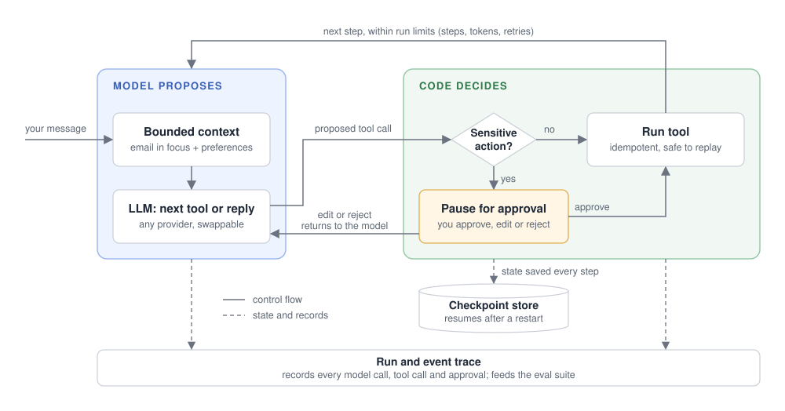

# FeedFlux

   

FeedFlux is an email agent that turns a busy inbox into clear next steps, lets you write drafts alongside AI, and keeps you in control of every proposed action.

## Why FeedFlux

### 1. Turn inbox overload into clear next steps

FeedFlux reviews unread email in batches and suggests what to do next. You choose which actions to apply and can undo local changes.

### 2. Co-create drafts in one workspace

You and the AI work on the same saved draft: create, edit, rewrite selected text, and undo changes before sending.

### 3. Let AI propose; keep the final decision

FeedFlux shows its plan and waits for your confirmation before sensitive changes. It can also remember preferences such as reply tone, but only what you explicitly ask for or approve, and you can view, edit, or forget them at any time.

## How it works

FeedFlux is a local web app. A Next.js interface talks to a FastAPI backend that streams each agent turn. The LangGraph agent works on emails synced read-only from Microsoft Graph and cached in SQLite, and drafts, memories, checkpoints and run traces are stored locally. The diagram below zooms into a single agent turn.

### Inside one agent turn

<p align="center">
  <picture>
    <source media="(prefers-color-scheme: dark)" srcset="assets/architecture-dark.svg">
    
  </picture>
</p>

The model proposes; the harness decides. It owns state transitions, approval pauses, budgets, and observable events, which keeps each agent turn constrained and inspectable.

The model sees only bounded context, such as the email you are reading, and answers that cite emails link back to the original message.

### Optional decision model (experimental)

FeedFlux includes an optional decision model, [Jev](https://docs.typesafe.ai/introduction), for batch triage. It is off by default. In shadow mode it records its suggestions without changing what you see. It has been checked on a 38-case labelled set; making it part of the main triage flow depends on the comparison in the roadmap below.

## Evidence

### Reproducible agent evaluation

- 5 fixed test tasks: meeting replies, batch triage, draft creation, draft rewriting, and approval before a risky action.
- 3 model providers × 3 trials per task, for 45 recorded trials.
- Tasks that change data are graded on the final database state, not just on what the model says.
- Raw records and summaries are versioned under [`backend/evals/results`](backend/evals/results).

### Runtime failure verification

A fault-injection suite that makes no real model calls covers 6 cases: recovery from timeouts and 429 errors, bounded retry on 5xx errors, no retry on validation or tool failures, resuming a pending approval after a restart, and replaying a request without creating a duplicate draft. Each case records its run and event outcome.

## Data handling

When connected to Microsoft Graph, FeedFlux incrementally fetches a bounded set of Inbox messages into a local SQLite cache, plus a local vector index that supports email summaries. Microsoft Graph remains the source of truth. FeedFlux asks for read-only mailbox access: triage and send actions stay behind local review and dry-run safeguards, and attachments are not downloaded. If you enable the optional decision model, email subject, sender, and a short preview are also sent to its hosted API.

Treat the local `data/` directory as sensitive application data. It may contain fetched message content, drafts, agent checkpoints, run traces, and authentication cache files.

## Try it

You need Docker and a Gemini API key.

1. Create your settings file:

   ```bash
   cp backend/.env.example backend/.env
   ```

2. Open `backend/.env` and set these two lines:

   ```bash
   GOOGLE_API_KEY=<your Gemini API key>
   LLM_PROVIDER=gemini
   ```

3. Start FeedFlux with the sample inbox:

   ```bash
   ./start.sh --sample
   ```

4. Open `http://localhost:3000` and click "Login with Microsoft Outlook". With the sample inbox this is a simulated sign-in, and nothing touches a real mailbox.

Running step 3 again resets the sample inbox. To run the agent on DeepSeek or GLM instead, set `LLM_PROVIDER` to `deepseek` or `glm` and add `DEEPSEEK_API_KEY` or `GLM_API_KEY`. The Gemini key is still used for email summaries.

<details>
<summary>Use your own Outlook mailbox</summary>

Use a public-client app ID (device-code flow, delegated `User.Read` and `Mail.Read`) and set it in `backend/.env`:

```bash
MS_CLIENT_ID=14d82eec-204b-4c2f-b7e8-296a70dab67e
```

This is Microsoft's own public client ID for Graph tooling, so the consent screen shows that app's name instead of FeedFlux.

Then sign in once:

```bash
docker compose run --rm backend python -m app.core.auth
```

</details>

## Roadmap

1. **Memory comparison:** Measure whether saved preferences improve results by running the same tasks with memory off and on.
2. **Decision model comparison:** Compare [Jev](https://docs.typesafe.ai/introduction) with the current LLM on batch triage end to end, and decide whether it becomes the default. The current LLM stays in charge of drafting and conversation.
3. **Concurrency hardening:** One active request per conversation, limits on concurrent model calls, cancellation, and load tests against a fake model.

## License

MIT
